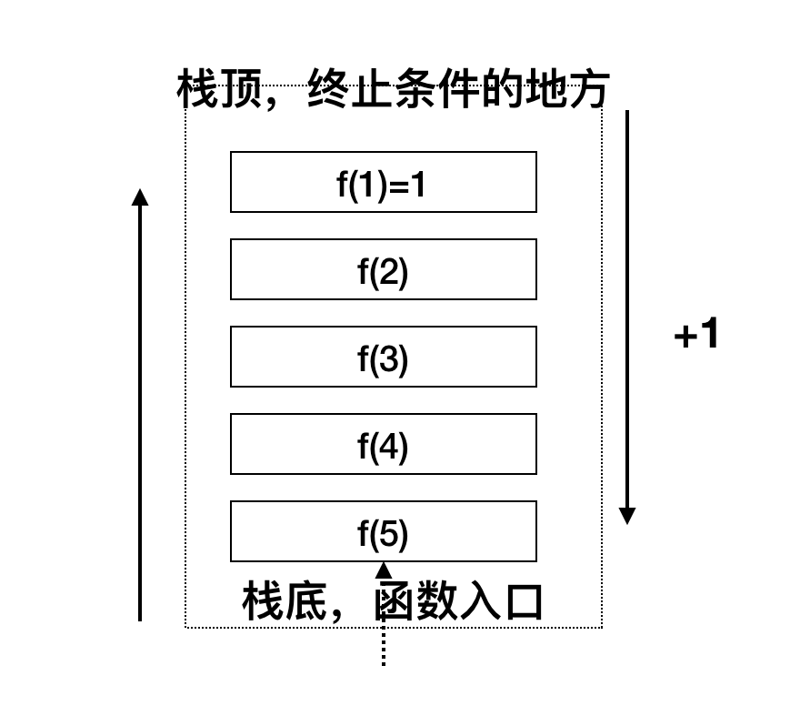

## 递归

### 什么是递归？

试想一下电影院自己在第几排的场景, 想要知道我在第几排，那么就要去问前面的人他处于第几排，那么前面的人又怎么知道他自己在第几排呢？那自然是他也要去问他前面的人咯.

这就是递归的场景，去的过程叫做“递”, 回来的过程叫做“归”，有来有回。

递归其实就是利用栈的数据结构，再加上一些简单的逻辑算法从而完成了问题的求解。只不过这个栈是由系统来提供的，我们只是无感知罢了.

### 适合场景

满足下面两点：

* 一个问题的解可以分解为几个子问题(规模更小的问题)的解, 并且子问题和问题除了数据规模不一样，求解思路是完全一样的。
* 存在终止条件

那么如何编写递归代码呢？

关键在于找到将大问题分解为小问题的规律，写出递归公式，然后在推敲出终止条件。

递归代码简洁高效，但是容易出现堆栈溢出，重复计算，函数调用耗时多，空间复杂度高等问题。一般嵌套比较少的场景可以使用递归。

### [递归题目](./recursion.md)

### leetcode

| &emsp;题号&emsp; | 题目链接&emsp;&emsp;&emsp;&emsp;&emsp;&emsp;&emsp;&emsp;&emsp;&emsp;&emsp;&emsp;| 答案链接&emsp;&emsp;&emsp;&emsp;&emsp;&emsp;&emsp;&emsp;&emsp;&emsp;&emsp;&emsp;| &emsp;难度&emsp;  | &emsp;完成度&emsp;  |
| :--: | :--: | :----------------------------------------------------------- | :-----------------------------------------------------------  | :------: |
|  22   | [括号生成](https://leetcode-cn.com/problems/generate-parentheses/)| [generateParenthesis](./recursion/leetcode/medium/generateParenthesis.h) | ✨✨ | ✅ |
|  687   | [最长同值路径](https://leetcode-cn.com/problems/longest-univalue-path/)| [longestUnivaluePath](./recursion/leetcode/medium/longestUnivaluePath.h) | ✨✨ | ✅ |

### 剑指Offer
| &emsp;题号&emsp; | 题目链接&emsp;&emsp;&emsp;&emsp;&emsp;&emsp;&emsp;&emsp;&emsp;&emsp;&emsp;&emsp;| 答案链接&emsp;&emsp;&emsp;&emsp;&emsp;&emsp;&emsp;&emsp;&emsp;&emsp;&emsp;&emsp;| &emsp;难度&emsp;  | &emsp;完成度&emsp;  |
| :--: | :--: | :----------------------------------------------------------- | :-----------------------------------------------------------  | :------: |
|  --   | [剑指Offer（七）：裴波那契数列](https://www.nowcoder.com/practice/c6c7742f5ba7442aada113136ddea0c3?tpId=13&tqId=11160&tPage=1&rp=1&ru=/ta/coding-interviews&qru=/ta/coding-interviews/question-ranking)| [Fibonacci](./recursion/coding-interviews/Fibonacci.h) | ✨  | ✅  |
|  --   | [剑指Offer（八）：跳台阶]( https://www.nowcoder.com/practice/8c82a5b80378478f9484d87d1c5f12a4?tpId=13&tqId=11161&tPage=1&rp=1&ru=%2Fta%2Fcoding-interviews&qru=%2Fta%2Fcoding-interviews%2Fquestion-ranking)| [jumpFloor](./recursion/coding-interviews/jumpFloor.h) | ✨  | ✅  |
|  --   | [剑指Offer（九）：变态跳台阶](https://www.nowcoder.com/practice/22243d016f6b47f2a6928b4313c85387?tpId=13&tqId=11162&tPage=1&rp=1&ru=%2Fta%2Fcoding-interviews&qru=%2Fta%2Fcoding-interviews%2Fquestion-ranking)| [jumpFloorII](./recursion/coding-interviews/jumpFloorII.h) | ✨ | ✅  |
|  --   | [剑指Offer（九）：变态跳台阶](https://www.nowcoder.com/practice/22243d016f6b47f2a6928b4313c85387?tpId=13&tqId=11162&tPage=1&rp=1&ru=%2Fta%2Fcoding-interviews&qru=%2Fta%2Fcoding-interviews%2Fquestion-ranking)| [jumpFloorII](./recursion/coding-interviews/jumpFloorII.h) | ✨| ✅  |
|  --   | [剑指Offer（十）：矩形覆盖]( https://www.nowcoder.com/practice/c6c7742f5ba7442aada113136ddea0c3?tpId=13&tqId=11160&tPage=1&rp=1&ru=/ta/coding-interviews&qru=/ta/coding-interviews/question-ranking)| [rectCover](./recursion/coding-interviews/rectCover.h) | ✨  | ✅  |